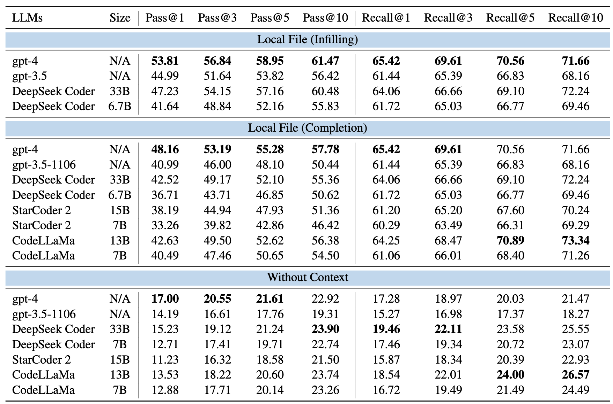

# DevEval

DevEval is a code generation benchmark collected through a rigorous pipeline. DevEval contains 1,825 testing samples, collected from 115 real-world code repositories and covering 10 programming topics. Compared to existing benchmarks, DevEval aligns to real-world repositories in multiple dimensions, e.g., code and dependency distributions. More details about DevEval can be found in our paper [link](https://arxiv.org/abs/2405.19856).

## Metadata
The metadata of DevEval is stored in `data.tar.gz`. Users can uncompress the file to get the metadata - `data.jsonl`. 
```Bash
tar -xzvf data.tar.gz
```

Each line of metadata is a json object, which contains the following fields:
- `namespace`: string, the unique name of the code to be generated, e.g., `benedict.utils.type_util.is_bool`.
- `type`: string, the type of the code to be generated. `method` means the code is a member function in a class, and `function` means the code is a individual function.
- `project_path`: string, the path of the project, e.g., `Text Processing/python-benedict`.
- `completion_path`: string, the path of the file where the code to be generated is located, e.g., `Text Processing/python-benedict/benedict/utils/type_util.py`.
- `signature_position`: list, the start and end line number of the signature within completion files e.g., `[238, 238]`. The line number starts from 1.
- `body_position`: list, the start and end line number of the reference code within completion files e.g., `[239, 254]`. The line number starts from 1.
- `dependency`: dict, the reference dependency. The keys include `intra_class`, `intra_file`, and `cross_file`. Each key stores a list of strings, which are namespaces of reference dependencies.
- `indent`: int, the indent of the code to be generated.
- `tests`: list, a list of test functions, which are used to evaluate the generated code.
- `requirement`: dict, the requirement of the code to be generated. The keys include `Functionality` and `Arguments`. `Functionality` is a string describing the functionality of the code to be generated. `Arguments` is a string explaining the input and output parameters.

## Setup

Before running the evaluation, researchers need to download the repositories, and dependency data.

### Repositories

The original repositories can be downloaded from [link](https://huggingface.co/datasets/LJ0815/DevEval/blob/main/Source_Code.tar.gz). Users need to uncompressed the repositories and put them in the root directory (e.g., `DevEval/Source_Code`).

The project contexts are stored in `Source_Code`. `Source_Code` contains 10 subfolders, each of which corresponds to a programming topic, e.g., `Text Processing`. Each topic contains multiple repositories. For each sample in metadata, we can find its repository based on the key `project_path`. Please do not modify the file structure of the repositories. Otherwise, the evaluation script can not work properly.

### Dependency Data

The dependency data of repositories is used to evaluate the recall of reference dependencies and is available in [link](https://huggingface.co/datasets/LJ0815/DevEval/blob/main/Dependency_Data.tar.gz). Users need to uncompressed the dependency data and put them in the root directory (e.g., `DevEval/Dependency_Data`). Please do not modify the file name of the dependency data. Otherwise, the evaluation script can not load the cached dependency data.

## Evaluation

### Environment Setup
Create a virtual conda environment and install the required packages.
```bash
conda create --name DevEval --file environment.txt
conda activate DevEval
pip install -r requirement.txt
# replace the path with your own path
echo "export NLTK_DATA=/home/user/DevEval/nltk_data" >> ~/.bashrc
source ~/.bashrc
```

Users can execute `python pass_k.py` to check whether the environment is normal. This command executes test cases on ground-truths and stores failed samples in `failed_samples.jsonl`.

### Completion Format
User need to convert models' predictions into a jsonl file. Each line of the jsonl file is a json object storing a completion for a requirement. An example of a json object is shown below.
```json
{
    "namespace": "benedict.utils.type_util.is_bool",
    "completion": "    config_options = {}\n    # Code to retrieve options from the \"twtxt\" section of the config file\n    # If the section does not exist, return an empty dictionary\n    return config_options\n"
}
```
We provide processed completion files of a few LLMs in `Experiments`.


### Notes

1. The pipeline of our evaluation is described as follows. For each sample, we first locat its `completion_file` and `body_position`. Then, we replace the code at `body_position` with the generated code. Finally, we run test cases to check the generated code. After that, we recover the original code at `body_position` for the next sample.

2. Because a repository often contains multiple samples in DevEval, researchers should avoid simultaneously running multiple evaluation scripts within the same repository. Otherwise, the evaluation results may be incorrect.


### Pass@k (Functional Correctness)

Users can run `run_pass_k.sh` to compute the Pass@k. The script is shown below.

```Bash
ROOT=/home/user/DevEval
TASK=without_context
Model=gpt-4-1106-preview_greedy

python $ROOT/check_source_code.py $ROOT/Source_Code

python pass_k.py \
    --output_file $ROOT/Experiments/$TASK/$Model/completion.jsonl \
    --log_file $ROOT/Experiments/$TASK/$Model/test_output.jsonl \
    --source_code_root $ROOT/Source_Code \
    --data_file $ROOT/data.jsonl \
    --n 1 \
    --k 1
```
The arguments are explained as follows.
- `output_file`: the model's predictions.
- `log_file`: the output file that stores the evaluation results.
- `source_code`: the path of repositories.
- `data_file`: the metadata file.
- `n`: the number of generated programs per requirement.
- `k`: the k value in Pass@k.

### Recall@k (Recall of Reference Dependency)

Users can run `parser/run_recall_k.sh` to compute the Recall@k. The script is shown below.

```Bash
cd parser
```

```Bash
ROOT=/home/user/DevEval
TASK=without_context
Model=gpt-4-1106-preview_greedy

python $ROOT/check_source_code.py $ROOT/Source_Code

python recall_k.py \
    --output_file $ROOT/Experiments/$TASK/$Model/completion.jsonl \
    --log_file $ROOT/Experiments_2024/$TASK/$Model/dependency_results.jsonl \
    --source_code_root $ROOT/Source_Code \
    --dependency_data_root $ROOT/Dependency_Data \
    --data_file $ROOT/data.jsonl \
    --k 1 
```
The arguments are explained as follows.
- `output_file`: the model's predictions.
- `log_file`: the output file that stores the evaluation results.
- `source_code`: the path of repositories.
- `dependency_root`: the path of the dependency data.
- `data_file`: the metadata file.
- `k`: the k value in Recall@k, e.g., `1` or `3,5,10`

## Repository-level Code Generation

### Experimental Settings

- **Without_Context**: Generate code based on the signature and requirement. 
- **Local File (Completion)**: Generate code based on the signature, requirement, and local file (contexts above). The local file means the file where the target code is located. Contexts above means the contexts above the target code. It simulates human developers write new code at the end of a file.
- **Local File (Infilling)**: Generate code based on the signature, requirement, and local file (contexts above+below). Contexts above+below means the contexts above and below the target code. It simulates human developers write new code in the middle of a file.
  
### Prompts

We release all prompts used in the above three settings. The prompts are stored in `Experiments/prompt`. `LM_prompt_elements.jsonl` contains the prompt elements for language models, and other prompt files are used for instruction-tuned models.

### Runing LLMs

We resue the code implementations in EvoCodeBench to run LLMs. Users can refer to the [link](https://github.com/seketeam/EvoCodeBench/tree/main).

### Model's Completion

We release models' predictions on DevEval. Users can find the completions in the `Experiments/model_prediction` folder. For example, 
- `Experiments/model_prediction/without_context/codellama-7b_greedy/completion.jsonl`: the completion of CodeLLaMa-7B-Python with greedy decoding in the baseline setting.
- `Experiments/model_prediction/without_context/codellama-7b/completion.jsonl`: the completion of CodeLLaMa-7B-Python with temperature sampling in the baseline setting. The sampling parameters can be found in our paper.

### Leaderboard



## Citation
If you have any questions or suggestions, please email us at `lijia@stu.pku.edu.cn`.

If you find this repository useful, please cite our paper:
```
@article{DevEval,
  title={DevEval: A Manually-Annotated Code Generation Benchmark Aligned with Real-World Code Repositories},
  author={Li, Jia and Li, Ge and Zhao, Yunfei and Li, Yongmin and Liu, Huanyu and Zhu, Hao and Wang, Lecheng and Liu, Kaibo and Fang, Zheng and Wang, Lanshen and others},
  journal={arXiv preprint arXiv:2405.19856},
  year={2024}
}
```
